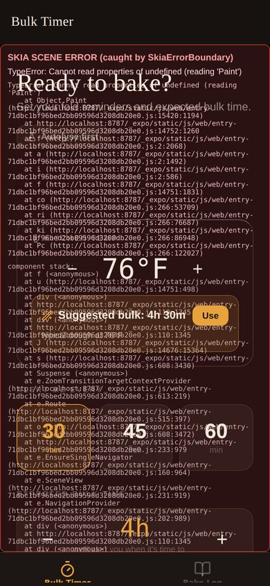
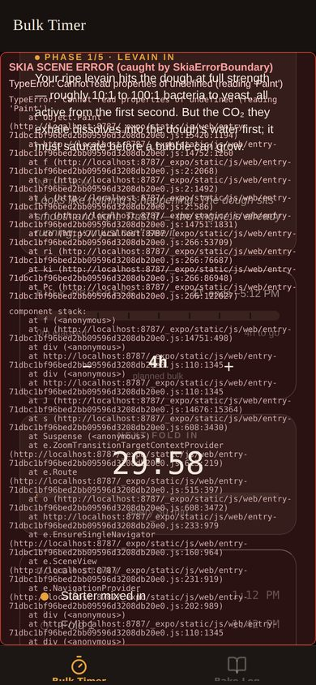
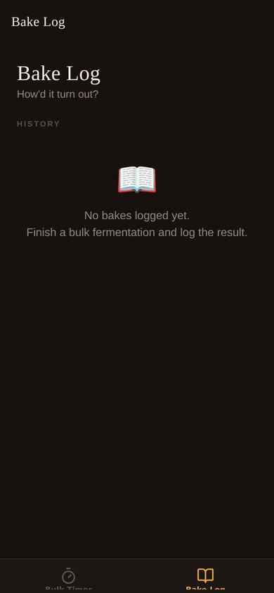
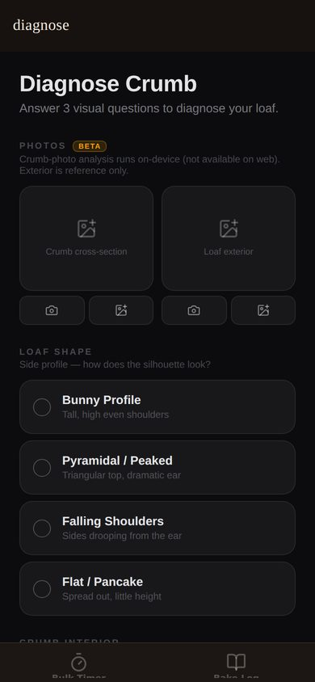

# Design & UX Modernization Plan — July 2026

**Goal:** an app that's intuitive, beautiful, fun to use, and easy to recommend —
where every surface looks *made for this app*, not assembled from generic
rounded-rectangle parts.

**How this doc was made:** a first-hand audit of every screen (all findings cite
`file:line`), real screenshots of the current build (in
`docs/design-modernization-shots/`), and a research pass over the best-designed
2025–2026 apps in neighboring niches (cooking, process-tracking, delight-first
indie apps) plus the current platform design languages (Apple Liquid Glass,
Material 3 Expressive). Sources are linked in Part 2.

---

## The north star

This app already owns something no competitor has: a **scientifically-grounded,
living fermentation scene** (`components/SkiaFermentationScene.tsx`) — real
organisms, additive-glow microscopy, driven by an actual dough model — wrapped
in a warm espresso-and-honey palette with a voice that teaches real science
(`components/FermentationScene.tsx:46-82`).

The modernization is **not** "add trends." It is:

> **Everything in the app should feel like it belongs to the living thing at
> its center.** Controls behave like dough (they squish, spring, and rise).
> Surfaces behave like glass slides over a culture. Numbers behave like lab
> instruments. Words behave like a calm mentor who knows the biology.

Every decision below traces back to that sentence.

---

## Part 1 — Audit of the current app

### 1a. What's already excellent — protect these

| Strength | Where | Why it matters |
|---|---|---|
| The Skia "microscope" scene + real backdrop-blur glass panels | `SkiaFermentationScene.tsx`, `GlassCard.tsx`, `glassStage.ts` | The crown jewel. Genuinely bespoke; nothing else on the market looks like this. |
| Warm bakery palette (espresso `#171210`, honey `#E8A33D`, cream `#F2E8DC`) | `components/theme.ts` | Distinctive vs. the sea of blue/gray apps; already "anti-corporate" in the 2026 direction. |
| Phase copy: science line + "in the bowl" sensory line per phase | `FermentationScene.tsx:46-82` | A real voice. People screenshot copy like this. |
| Spring-press buttons, haptic `thump()`, fold-counter pop, celebration bubbles | `index.tsx:60,198,519,814` | The timer screen already *feels* physical. |
| The coach: Q10 temperature model + your own bake history + last-bake correction | `lib/bulkCoach.ts:83-133` | Real intelligence — the same "we predict and show our work" DNA that made Flighty famous. Currently undersold by the UI. |
| Late-fold recovery, undo-end-bulk, custom overlay dialogs | `index.tsx:566`, `log.tsx:228-254` | Thoughtful, forgiving UX in the moments that matter. |
| Android live status panel + insistent fold alarms | `lib/bulkStatusPanel.android.ts`, `lib/foldAlarm.ts` | Platform-native reliability most indie apps never build. |

### 1b. Where the spell breaks — the "generic" problem, itemized

**Fracture 1 — The app has two faces.** `app/(tabs)/diagnose.tsx:21-43`
defines a *second, older palette* — cool zinc-black `#0c0c0f`, stock Tailwind
amber `#F59E0B`, gray cards — and none of the warm theme, serif, haptics, or
motion. It looks like a different product (see `diagnose-sm.jpg`). It's also
**orphaned**: hidden from the tab bar (`_layout.tsx:39`) and nothing navigates
to it — the log flow reimplemented it. Its nav header literally shows the
lowercase route name "diagnose."

**Fracture 2 — First impressions are the old design.** The splash screen and
Android adaptive icon background are `#0c0c0f` (`app.json:17,51`) — the cold
black, not the warm espresso. The app icon itself is a **plain orange circle**
(`assets/images/icon.png`) — a placeholder, while the fold-wheel notification
art (`assets/images/fold-wheel/`) already shows the charming style the icon
should have (dough dome + bubbles + honey progress arc).

**Fracture 3 — One shape for everything.** Nearly every element on every
screen is the *same component in different sizes*: a rounded rectangle
(radius 10–24) with a 1px hairline border and a faint fill. Option chips,
primary CTAs, info cards, alerts, steppers, stat tiles, radio rows — all one
grammar (`index.tsx:1153-1421`, `log.tsx:76-115`, `diagnose.tsx:486-541`).
Nothing signals "this is THE button" vs "this is a setting" vs "this is
information" except size. This is the precise source of the "generic button
shapes" feeling.

**Fracture 4 — Tap-tap-tap steppers.** Four separate `−`/`+` steppers (kitchen
temp, expected bulk, planned folds, rise %) — up to 32 taps to set a
temperature (`index.tsx:1221-1235`). The most-touched controls in the app are
its most generic and most tedious.

**Fracture 5 — System fonts only.** No font is actually loaded (`expo-font`
installed, unused). "Display serif" is Georgia on iOS and whatever `serif`
maps to on Android (`theme.ts:38`) — inconsistent across platforms and not
ownable. Timer digits are Menlo/monospace — terminal vibes, not lab-instrument
vibes. Font sizes are 28 hand-tuned raw numbers (9→88) with no scale.

**Fracture 6 — The flagship ML moment is a spinner.** "Analysing crumb…" is a
dimmed photo + stock `ActivityIndicator` (`log.tsx:319-327`). This is the
feature the app is named for, reduced to its most generic possible state. (Also
spelled "Analysing" here and "Analyzing" in diagnose.tsx — pick one.)

**Fracture 7 — Bakes are logged, then forgotten.** `BakeLog` persists only
duration + fold count + diagnosis label (`store/useBakeStore.ts:22-24`). The
crumb photo is analyzed and **thrown away**; temp, rise %, fold times, notes —
all discarded. So History is a list of near-identical text cards
(`log.tsx:83-117`) instead of a shelf of *your loaves*, and the coach learns
less than it could.

**Fracture 8 — Emoji standing in for design.** 🫙 📖 ✅ ⏱️ 🫠 🐰 🔺 🫓 ⬜ 🟡 🟤 💧 🪨
(`log.tsx:12-45,277,298`) — platform emoji clash with the refined microscopy
art and read differently on iOS vs Android. The empty state — the first thing
every new user sees on the Log tab — is a stock book emoji floating in a void
(`log-sm.jpg`).

**Fracture 9 — Broken glass on web + debug panel in production paths.** On web
the Skia module can't load, and the "fallback" is a **red on-screen stack
trace** rendering behind the entire timer UI (`SkiaErrorBoundary.tsx:70-99` —
see `timer-idle-sm.jpg`; the file itself says it's temporary scaffolding). The
pure-JS `FermentationScene` fallback already exists but is never used as the
fallback.

**Fracture 10 — Chrome nobody chose.** Default expo-router headers repeat the
title that's already on the page ("Bake Log" twice — `log-sm.jpg`); the stock
tab bar is an opaque strip with a hairline that sits over the full-bleed scene;
no safe-area handling anywhere (`useSafeAreaInsets`: zero uses); no
`StatusBar` management.

**Fracture 11 — Accessibility is at zero.** No `accessibilityLabel`,
`accessibilityRole`, or `hitSlop` anywhere in the app (grep: 0 matches).
Icon-only buttons (camera, `+`/`−`, `×`) are invisible to screen readers.
`textDim` = cream at 30% alpha is used for load-bearing copy ("tap to record a
fold") — below WCAG contrast. US-only units (°F hardcoded, `doughTempF`)
limits who you can recommend it to.

**Fracture 12 — Dead toolchain weight.** NativeWind + Tailwind + PostCSS fully
wired, **zero** `className` uses (357 inline styles instead); `react-native-svg`,
`expo-symbols` installed, unused. Confuses every future session about "how we
style here."

### 1c. Current-state evidence

| | |
|---|---|
|  |  |
| *Timer (idle) on web: the debug panel bleeds through every glass card.* | *Timer (active): strong bones — phase copy, timeline, big digits.* |
|  |  |
| *Log: double header, emoji empty state, a void.* | *Diagnose: the orphaned second design system — cool grays, stock radios.* |

*(Native builds don't show the red panel — the scene device-verified July 2026 —
but web is what a curious friend clicks first.)*

---

## Part 2 — Field research: what the best 2025–26 apps do

### 2.1 What juries reward in exactly our genre

The last two award cycles are shockingly good news for this app — the winners
are *slow-natural-process trackers*:

- **ADA 2026 Interaction winner: Moonlitt** (moon-phase tracker) and **Visuals
  winner: Tide Guide**, whose palette shifts with the sky through the day —
  both "watch a natural cycle" utilities, structurally identical to a
  fermentation timer ([apple.com/design/awards](https://developer.apple.com/design/awards/)).
- **Google Play Best App 2025: Focus Friend** — a timer whose whole UI is an
  anxious bean knitting socks while you wait ([blog.google](https://blog.google/products-and-platforms/platforms/google-play/best-apps-games-2025/)).
  A mascot with feelings + a single-purpose timer = app of the year.
- **ADA 2026 Delight & Fun: grug** — hand-drawn, no accounts, no extras;
  charm through restraint ([Cult of Mac](https://www.cultofmac.com/news/apple-design-awards-crown-top-apps-and-games)).
- **The only food app to win an ADA: Crouton (2024, Interaction)** — won for
  ruthless hierarchy and flow ("how quickly can I get you back to the meal"),
  not visual spectacle. **Mela** placed in 2025 for its cook mode: bold
  current step, dimmed past steps, Live Activity timers
  ([developer.apple.com](https://developer.apple.com/design/awards/2024/), [mela.recipes](https://mela.recipes/)).
- **App Store 2025 iPhone App of the Year: Tiimo** — "a timeline of soothing
  colors" ([MacRumors](https://www.macrumors.com/2025/12/04/apple-announces-2025-app-store-award-winners/)).

**The lesson:** our category's bar is *interaction, hierarchy, calm, and one
committed idea* — not maximal decoration. The Skia scene + science voice is
already the "one committed idea." The awards also carry a warning (Amie
diluted its beloved calendar chasing AI notes and lost its fans —
[Efficient App](https://efficient.app/apps/amie)): timer + crumb readout,
executed completely, nothing extraneous.

### 2.2 The borrow list — patterns we're stealing and how we remix them

| # | Pattern (source) | Remix for Sourdough Timer |
|---|---|---|
| 1 | **Non-judgmental "readiness" voice** — Gentler Streak never scolds; metrics described, never graded ([sketch.com](https://www.sketch.com/blog/gentler-streak/)) | Diagnosis verdicts and late-fold copy stay descriptive + next-time-actionable ("moved faster than expected — warm kitchen; try pulling bulk 30 min earlier"). Never "FAILED." Already half our voice — codify it. |
| 2 | **Flight timeline + drifting ETA** — Flighty's one-glance "where is it, when does it land," delay alerts *before the airline's* ([developer.apple.com](https://developer.apple.com/news/?id=970ncww4)) | The Journey card (§4.2): phases mix→folds→bulk→shape, live marker, ETA that re-flows from the Q10 model — "Kitchen dropped to 68°F, shaping now lands ~9:40pm." |
| 3 | **Predicted-vs-actual corridor** — Gentler Streak's Activity Path band ([docs.gentler.app](https://docs.gentler.app/understanding-your-activity-path/interpret-the-activity-path)) | The rise tracker becomes a **corridor chart**: expected rise band from `estimatedRise()`, dotted line of the baker's actual marks. Our signature image. |
| 4 | **Cascading schedule** — Rise app: edit one step, downstream re-flows ([bakewithrise.com](https://bakewithrise.com/)) | Ours re-flows *automatically from temperature* — a genuine leapfrog. |
| 5 | **Cook-mode focus state** — Mela bolds now, dims the past ([mela.recipes](https://mela.recipes/)) | Active bulk = focus mode: current phase large serif, past phases dimmed, next ghosted; screen stays awake. |
| 6 | **Self-naming timers + HUD chip** — Crouton's ADA-winning trick ([tapsmart.com](https://www.tapsmart.com/apps/review-crouton/)) | "Fold 2 of 4 — 0:42" chip visible from the Shelf tab too. |
| 7 | **Scan-first AI ritual + report card** — plant/food scanners' reticle → analyzing → confidence card; Loaflo's graded panels ([loaflo.app](https://loaflo.app/)) | The scan ritual (§4.3), presented as a report card, with a tap-to-correct affordance that doubles as training-label collection. |
| 8 | **Time/process-adaptive palette** — Lumy & Tide Guide key their colors to the sky ([developer.apple.com](https://developer.apple.com/design/awards/)) | Accent temperature ramps with the bake: cool straw at levain-in → honey at the sweet spot → ember past target. Timer digits already lerp cream→honey (`index.tsx:1056`) — extend the idea app-wide. |
| 9 | **Multisensory moments, not 3D worlds** — Not Boring's haptic wheels; CapWords' sound-per-action ([notbor.ing](https://notbor.ing/product/camera)) | Three moments only: fold logged (soft squelch + squish), bulk done (crust-crackle + Success haptic), diagnosis revealed (tick + count-up). |
| 10 | **Pet/plant dependence** — Planta's roster of dependents; Waterllama/Focus Friend's fillable mascot ([getplanta.com](https://getplanta.com/)) | Deferred, deliberately (see Amie warning): the *scene* is already the living thing. A named-starter profile ("Herman is hungry — last fed 26h ago") is a strong future direction, after the core is polished. |
| 11 | **Photo-led history + teaching empty states** — Kitchen Stories cards; Copilot Money's premium empty states ([stackswitch.app](https://stackswitch.app/review/copilot-money)) | The Shelf (§4.4): full-bleed crumb photos; empty states that teach ("here's what an open crumb looks like") instead of apologize. |
| 12 | **Share artifact** — Flighty's Passport; Foodgeek's recipe-in-a-URL ([foodgeek.io](https://foodgeek.io/en/bread-calculator/)) | The bake card (§4.4) — photo + verdict + stats, into the share sheet. |

### 2.3 Competitive reality check (the 2025–26 sourdough wave)

A wave of sourdough apps shipped 2024–26: **Loaflo** (AI crumb feedback via
cloud, subscription priced "because compute costs" — 4.6★), **Sourdough
Journal** (insights/charts), **The Dough Lab**, **Sordo**, **Homebaker**
(per-step photo timeline), plus **Crustello** ($100 lid sensor graphing rise)
and **Breadwinner** (jar hardware with a mascot-fronted "starter just peaked"
alert). None of them have our combination. **The moat:** on-device (instant,
offline, private, free — the anti-Loaflo), science with citations (the books
in `docs/references/`), and the living scene. The plan's job is to make that
moat *visible in screenshots*.

### 2.4 Platform design languages — what to adopt, what to skip

- **Liquid Glass (iOS 26→27):** adopt the *free, authentic* parts — Expo
  Router `NativeTabs` (real glass capsule tab bar on iOS 26, Material 3 tabs
  on Android, classic bar on old iOS), concentric corner radii, at most one
  scoped `GlassView`. Skip fake refraction and glass-on-glass: Apple itself
  is reducing transparency in iOS 27, and NN/g's legibility critique
  ([nngroup.com](https://www.nngroup.com/articles/liquid-glass/)) validates
  our rule — glass only over the scene, opaque surfaces elsewhere. Our
  Skia-drawn glass is *already more real* than most apps' — it just needs
  restraint in how much content sits on it.
- **Material 3 Expressive (Android 16/17):** approximate the *feel* — springy
  motion physics, shape-morph on state change (Start button capsule→square is
  the M3E play/pause idiom), oversized emphasized type. Skip chasing
  react-native-paper (its M3E support is incomplete).
- **2026 trend alignment that costs us nothing:** warm/earthy anti-corporate
  palettes are *the* 2026 palette trend — bread colors are literally on-trend;
  dark-mode-first matches real usage (checking dough in a dark kitchen);
  oversized numerals; Live Activities as table stakes for timers.

---

## Part 3 — The design direction: "The Warm Microscope"

One identity, radiating outward from the scene. Six pillars:

### 3.1 Color: one palette, three depths

Keep the existing warm tokens (`theme.ts`) as the base and **delete the second
palette**. Extend to a real system:

- **Depth 0 — The culture.** Pure black scene canvas (`#000`) — only the
  organisms glow. Unchanged.
- **Depth 1 — The bench.** App surfaces: espresso `#171210` → deep-crust
  gradient tops (`#1C1614` → `#171210`) instead of flat fills, so screens
  without the scene (Shelf) still have warmth and depth.
- **Depth 2 — The slide.** Glass panels (existing `GlassCard`) reserved for
  content floating *over the living scene*. Solid "parchment" cards
  (`#221B17`-ish, no hairline border, soft shadow) for content on the bench —
  ending the everything-is-outlined look.
- **Semantic accents stay** (honey/green/terracotta) but purple/orange stock
  Tailwind leftovers (`#c084fc`, `#fb923c`) get re-derived from the organism
  palette (violet LAB `#C9A8D6`, protease coral `#E58C76` —
  `docs/fermentation-art-spec.md` already locks these).
- **Honey `#E8A33D` becomes sacred:** only living/active things may glow honey
  (running timer, due fold, the culture). Buttons that merely *do things* use
  cream/parchment. This single rule creates hierarchy the app currently lacks.
- **The palette breathes with the bake** (the Lumy/Tide Guide move): the
  accent temperature ramps subtly with fermentation phase — cool straw at
  levain-in, full honey in the sweet spot, ember tones past target. The timer
  digits already do this (`index.tsx:1056`); it becomes a system-wide ramp
  the scene, progress elements, and Live Activity all share.

### 3.2 Type: load real fonts, build a scale

- **Display: Fraunces** (free, variable, Google Fonts) — a warm "wonky" serif
  that looks like a bakery chalkboard drawn by a scientist. Replaces
  Georgia/`serif` for titles, phase names, celebration copy.
- **Numerals: tabular figures** on a humanist sans (system SF/Roboto with
  `fontVariant: ['tabular-nums']`, weight 200–300 at display sizes) — lab
  instrument, not terminal. Menlo retires.
- **Body/UI: system sans** (SF/Roboto) — legibility where it counts.
- **A 7-step scale** replacing 28 ad-hoc sizes: 12 / 14 / 16 / 20 / 26 / 40 /
  76, each with a named role (`caption`, `body`, `emphasis`, `title`,
  `display`, `stat`, `hero`). Micro-labels stay uppercase+tracked but move to
  12pt minimum and 45% alpha minimum.

### 3.3 Shape: three tiers instead of one

- **Tier 1 — Dough (the one hero action per screen).** Start Bulk / record-fold
  / Diagnose: big soft *organic* shapes (asymmetric corner radii, e.g.
  `28/32/30/26`, like a proofing boule — not a pill, not a rect), solid honey
  or cream fills, glow shadows, spring+squish press (scale *and* slight skew,
  like poking dough).
- **Tier 2 — Tools (settings, pickers, secondary buttons).** Capsule chips and
  solid parchment cards, **no hairline borders** — selection shown by fill +
  honey ring, not border color swaps.
- **Tier 3 — Slides (information).** GlassCard over the scene; parchment cards
  elsewhere; generous 24px radius, concentric nesting (**inner radius = outer
  radius − padding** — the iOS 26 "concentricity" rule, pure math, works on
  both platforms; `GlassCard` already takes a `radius` prop). Today's nested
  cards break this constantly (radius-14 boxes inside radius-20 cards with
  varying padding), which is part of why they read as assembled, not designed.

### 3.4 Motion & touch: dough physics

Codify what `Springy` started (`index.tsx:198`) into a motion kit:
- **Press:** squish (scale 0.96 + skew), release: spring overshoot
  (`friction 4`) — every tappable, all three screens (today: timer only).
  New motion should use **Reanimated 4's CSS-style animation API** — it needs
  no `'worklet'` directives, so it sidesteps the exact Babel-worklets hazard
  documented in `docs/SKIA-HANDOFF.md`.
- **Arrive:** cards rise 16px + fade on mount (exists on timer active view —
  make it universal, stagger 40ms).
- **Numbers:** count-up/roll transitions on stat changes (fold count already
  pops — extend to rise %, confidence %).
- **Haptic map:** Light = selection, Medium = commit, Heavy = milestone,
  Success pattern = phase change / bulk end. (Half of this exists in
  `thump()` — document it, then apply to log + diagnosis flows which have
  zero haptics today.) On Android, use `Haptics.performAndroidHapticsAsync`
  (`Clock_Tick` / `Segment_Tick`) for dial/ruler detents — a distinct
  "instrument tick" vocabulary bakers learn without looking (the Filtru
  pattern).

### 3.5 Iconography & illustration

- Replace all in-UI emoji with a **12-glyph custom icon set** drawn in the
  fold-wheel style (2px stroke, honey-on-espresso, rounded terminals): loaf
  side / crumb slice / jar / fold hand / thermometer / clock / flask / camera /
  shelf / spark / check / warning. Generated as SVGs (react-native-svg is
  already installed and unused) or as a generation spec like the proven
  `docs/design-handoff-fold-wheel-icon.md` pipeline.
- **App icon:** the fold-wheel mark (dough dome + bubbles + honey arc) on
  espresso — replacing the placeholder circle. Same mark seeds the splash.

### 3.6 Voice: the gentle scientist

The phase copy already nails it (`FermentationScene.tsx:46-82`). Codify the
rules so every new string matches:
- **Describe, never grade.** "Your dough moved faster than the model" — not
  "over-fermented ❌." Verdict colors stay warm even when the news isn't.
- **Always give the next-bake action.** Every diagnosis, advisory, and late
  notice ends with one concrete adjustment (the existing `RiseAdvisory` and
  `foldLatenessAdvice` already do this — it's the house style).
- **Science with sensory.** Pair the mechanism with what your hands would
  feel, per the existing two-line caption pattern.
- **Small celebrations, sparingly.** "Beautiful bulk." is perfect — one
  moment per bake, not confetti on every tap.

---

## Part 4 — Screen-by-screen plan

### 4.1 Timer (idle) → "Tonight's bake, planned like a flight"

The setup list becomes a **bake plan card** (one glass panel): temp dial +
suggested bulk + fold plan combined, with the coach's reasoning given top
billing ("Your 3 dialed-in bakes averaged 4.2h · 76° kitchen ferments
slower"). Replace steppers:
- **Temp: a dial** (arc drag, 1° haptic detents, °F/°C toggle on long-press —
  fixes international use).
- **Bulk length & folds: a ruler slider** (15-min ticks / fold detents).
Autolyse becomes a chip on the plan card, not a separate flow fork.
Start Bulk keeps its glow — it's the screen's only Tier-1 shape.

### 4.2 Timer (active) → one journey, one hero

Fuse the three mid-cards (`PhaseCaption` + `BulkProgressBar` + `DoughStory`)
into a single **journey card**: a vertical timeline with phase bands colored by
the science (Levain in → First rise → Bloom → Sweet spot → Knife's edge), a
live "you are here" marker breathing in honey, fold stops with actual/due
times, ETA at the bottom that updates with the target dial. (This is the
Flighty pattern: one glanceable answer — *where is my dough and when does it
land.*)
- Timer digits: tabular, 76pt, warming cream→honey as today (`index.tsx:1056`
  is a lovely detail — keep).
- **Rise tracker becomes the corridor chart** (the Gentler Streak pattern):
  the expected-rise band drawn from `estimatedRise()` over time, with the
  baker's actual marks as dots on a dotted line — tap the chart to log a mark
  (replacing the ±5% stepper). Predicted vs. actual, at a glance; advisory
  copy appears when the lines diverge (logic already exists in
  `RiseAdvisory`).
- **Record-fold becomes the dough pad**: the big counter card becomes an
  organic squishable blob that ripples bubbles up into the scene on press.
- **End Bulk & Shape** stops being red (`index.tsx:1649-1663`): it's the happy
  milestone — cream Tier-1 button with a hold-to-confirm fill (dough rising to
  fill the shape), keeping the undo net.

### 4.3 The scan ritual (log flow's analysing step)

Replace the spinner (`log.tsx:319-327`): full-bleed crumb photo, a slow honey
scan-line sweeping it, organism particles (reuse `Bubble`) gathering along
detected holes, then the verdict card springs in — **confidence drawn as a real
arc gauge** that fills with a count-up (replacing diagnose.tsx's fake static
ring), science reasoning beneath, in the app's voice. 10 seconds of theater
that makes the on-device model *feel* like the star it is. This is the moment
people screen-record and share.

### 4.4 Log → "The Shelf"

- **Persist the whole bake** (store migration, additive):
  `photoUri, doughTempF, risePercent, foldTimestamps, notes?` on `BakeLog`.
- History becomes a **2-column shelf of loaf cards** — crumb photo (or a
  generated placeholder crumb pattern when photo-less), date, verdict chip in
  diagnosis color, bulk time. Tap → bake detail: photo, its journey timeline
  replayed, diagnosis + reasoning, "bake it again" (pre-fills the plan).
- Stats row upgrades to a **trend strip**: dialed-in streak, avg bulk with a
  tiny sparkline, "best bake" shortcut.
- **Empty state:** custom illustration (empty wooden shelf + one hopeful
  bubble), copy in-voice: "Your shelf is waiting for its first loaf." + a
  primary "Start a bake" button that switches tabs — never a dead end.
- **Share card generator:** after saving a bake, offer a branded image (photo +
  verdict + stats + tiny fold-wheel logo) via the native share sheet. This is
  the "easy to recommend" engine — every shared loaf is an ad.

### 4.5 Diagnose (orphan) → fold in and delete

Delete the route. Its two unique bits move into the log flow: the exterior
photo slot, and the 3-question visual quiz (which gets the custom icon
treatment — tiny loaf-silhouette diagrams instead of text-only radios, using
the shape/crumb/crust drawings the options describe). One diagnosis pathway,
one design system.

### 4.6 Chrome

- `headerShown: false` on both tabs (in-page titles already exist); reclaim
  ~100px.
- **Tab bar: migrate to Expo Router's `NativeTabs`** — one component that
  renders the authentic floating Liquid Glass capsule bar on iOS 26+, the
  classic bar on older iOS, and Material 3 tabs on Android. This is the
  single highest-leverage "feels 2026" change and it's free in SDK 56 (works
  in Expo Go). Two tabs: **Bake** and **Shelf**, custom fold-wheel-style
  glyphs. (Fallback if NativeTabs styling proves too constraining: a custom
  floating parchment pill — but try native first.)
- Optionally, ONE scoped `expo-glass-effect` `GlassView` on iOS 26+ (e.g. the
  floating fold HUD chip), guarded by `isLiquidGlassAvailable()` — and no
  more. Apple is dialing transparency *down* in iOS 27; restraint reads
  current, maximal glass reads like a 2025 beta.
- Splash + adaptive icon backgrounds → `#171210`; new icon mark (and on iOS,
  an Icon Composer `.icon` layered version via `ios.icon` — needs a Mac, else
  ship the flat PNG); status bar managed (`expo-status-bar`, light content).
- Web: silent fallback to the pure-JS `FermentationScene` (it exists for
  exactly this), photo features hidden with a friendly note instead of dead
  buttons.

---

## Part 5 — The component kit to build (`components/ui/`)

Small, owned, reused everywhere — this is what kills "generic" permanently:

| Component | Replaces | Used in |
|---|---|---|
| `DoughButton` (Tier 1: organic shape, squish+glow) | 5 hand-rolled CTAs | Start, Fold pad, Diagnose, Save, Share |
| `Chip` / `ChipRow` (Tier 2 selection) | interval chips, autolyse options, quick-log rows | timer, log |
| `Card` (parchment) + existing `GlassCard` | ~14 hand-rolled card `View`s | all |
| `Dial` (arc drag + detent haptics) | temp stepper | timer; later starter hydration etc. |
| `Ruler` (horizontal slider, ticks, detents) | bulk-length, folds, rise steppers | timer |
| `Journey` (timeline w/ phase bands + marker) | `DoughStory`+`BulkProgressBar`+phase label | timer active, bake detail |
| `Gauge` (animated arc + count-up) | fake confidence ring | scan result |
| `ScanOverlay` | ActivityIndicator step | log flow |
| `Sheet` (branded modal) | `LateFoldConfirmOverlay` pattern, `Alert.alert` | all dialogs |
| `Toast` | silent failures, undo confirmations | all |
| `EmptyState` (illustration + line + action) | 📖 emoji void | shelf, offline/web notes |
| `Icon` (custom set) | lucide generics + emoji | all |
| `AppText` (role-based type scale) | 357 inline font styles | all |

Styling stays **inline-tokens** (grow `theme.ts` into `tokens.ts`: color,
space, radius, type, motion, haptics). Remove the unused Tailwind/NativeWind
toolchain in the cleanup phase (or actually adopt it — but 357 inline styles
say the codebase already voted; one system, either way).

---

## Part 6 — Roadmap (each phase = 1–3 Claude sessions, shippable on its own)

**Phase 0 — Stop the bleeding (1 session, no visual redesign)**
1. Web/failure fallback: `SkiaErrorBoundary` renders `FermentationScene`
   silently in production, debug panel only in `__DEV__`.
2. Delete the orphaned `/diagnose` route (after folding its exterior-photo slot
   + quiz into the log flow, or temporarily just delete — it's unreachable).
3. Splash/adaptive-icon/app-icon backgrounds → `#171210`; ship the fold-wheel
   app icon.
4. `headerShown:false` on tabs; kill double titles.
5. `Alert.alert` → styled overlay; unify "Analyzing"; add a11y labels to every
   icon-only control; bump `textDim` usage on load-bearing text to `textMuted`.
   - *Done when:* `npx tsc --noEmit` passes; fresh web screenshots show no red
     panel, no double headers; screen reader announces every control.

**Phase 1 — Tokens & type (1–2 sessions)**
1. `theme.ts` → full `tokens.ts` (palette depths, type scale, space, radius
   tiers, motion durations, haptic map) — additive, screens migrate gradually.
2. Load Fraunces via `expo-font`/`@expo-google-fonts`; tabular numerals for all
   digits; apply the 7-step scale everywhere (mechanical pass).
3. Re-skin log + remaining diagnose-flow remnants onto the warm system: solid
   parchment cards, no hairline-border-as-selection, custom icons replace
   emoji.
4. Voice pass over every user-facing string against §3.6 (describe don't
   grade, always a next-bake action).
   - *Done when:* zero references to the old `#0c0c0f` palette; a screenshot of
     each screen looks like one app.

**Phase 2 — Hands on dough (2–3 sessions)**
1. `DoughButton`, `Chip`, `Card`, `Sheet`, `AppText` built and swapped in.
2. `Dial` (temp, with °C) + `Ruler` (time/folds/rise) replace all four
   steppers.
3. Timer active view: `Journey` card fusion; rise **corridor chart**;
   dough-pad fold button; End-Bulk de-reddened with hold-to-confirm;
   celebration v2 (bubbles + scene surge).
4. Tab bar migration to NativeTabs (+ the fold HUD chip visible across tabs).
   - *Done when:* setting up a bake takes ≤6 touches (today: up to 40+ taps);
     every press in the app squishes and thumps; device build verified.

**Phase 3 — The scan & the shelf (2–3 sessions)**
1. Store migration: rich `BakeLog` (photo, temp, rise, folds, notes) +
   photo file management.
2. `ScanOverlay` + `Gauge` scan ritual.
3. Shelf gallery + bake detail + trend strip + `EmptyState` + share card.
   - *Done when:* a logged bake shows its photo on the shelf; sharing produces
     a branded image; the empty state invites rather than apologizes.

**Phase 4 — Beyond the glass (later, needs dev builds / store work)**
1. iOS Live Activity + Dynamic Island for bulk (next-fold countdown +
   "I folded" action — the Flighty/Coffee-Book move; `docs/launch-checklist.md`
   already wants this). Now practical: **expo-widgets is stable in SDK 56** —
   Live Activities written as React components, no SwiftUI needed (dev build
   required, which this app already needs for notify-kit). Android side
   already exists (`bulkStatusPanel.android.ts`).
2. Optional "Daylight" light theme for bright kitchens (tokens make it cheap).
3. Sound design pass (soft bubble pop on fold, oven "ting" at bulk end —
   respecting silent mode); App Store screenshot/preview kit built from the
   share-card system.

---

## Part 7 — Guardrails

- **Do not touch** the Skia scene's JS-thread animation architecture or add
  `'worklet'` directives (`docs/SKIA-HANDOFF.md`; hard-won).
- `GlassCard` radius must keep matching the container radius (`GlassCard.tsx:70`),
  and new layouts must keep cards registered with `glassStage` — re-measure
  after any layout change (scroll-settle tick already handles drift).
- Reanimated 4 is installed but unused; new motion can use it, but don't
  migrate working `Animated` code for its own sake.
- Fonts: load via `expo-font` with `SplashScreen` gating already in place;
  Fraunces variable→static instances if Android variable-font rendering
  misbehaves.
- Every phase ends with the CLAUDE.md checklist: `npx tsc --noEmit`, real
  screenshots (web: `npx expo export -p web` + `npx serve dist` + the
  Playwright script in `tools/screenshot-web.mjs`), and native-module changes
  verified on a device build before "done."
- Accessibility is an acceptance criterion, not a phase: labels, 44pt targets,
  contrast ≥ AA on load-bearing text, sane behavior at 130% font scale.

## Success criteria (the "recommendable" test)

1. **The screenshot test:** any screen, cold, posts well — nothing on it could
   belong to another app.
2. **The 30-second demo test:** scan a crumb photo → the ritual + verdict makes
   someone say "wait, show me that again."
3. **The kitchen test:** start-to-bulk in ≤6 touches with floury hands; every
   state readable at arm's length.
4. **The friend test:** share card lands in a group chat and the link-out is
   obvious.
5. **One design system:** grep finds zero `#0c0c0f`, zero emoji-as-UI, zero
   `Alert.alert`, zero unlabeled icon buttons.
